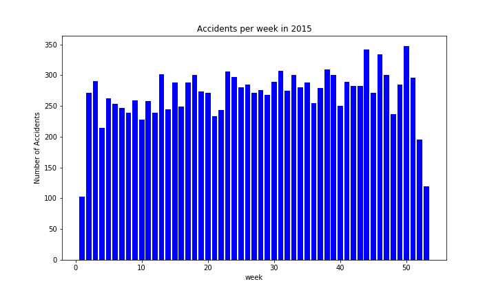

# Traffic Accident Patterns in Seattle

### *Extending a project by Gulom Saidov*

The city of Seattle publicly provides comprehensive data on traffic, collisions and streets & their conditions. In a first step we dig into timline patterns in the collision data. Further steps will look into accident hotspots in the city and their development over time.

Slides: https://docs.google.com/presentation/d/1NjCp65iQMG-ukc7dgZkvaqHdR0aIhejo9fQlQUmVcbs/edit#slide=id.g5ad0665c7b_0_60

# **Project Goal:**

- Explore accident data provided by the city of Seattle (2004 - 2019)
- Find time patterns by zooming into the timeline and comparison of time slices over all years
- Find hot spots by clustering using geospacial coordinates ( → later)

# **Motivation**

- Hot spots may be mitigated by planning/construction actions
- Commuters can try to avoid the hot spot, as well as the accident peak times

# **Source Data**

- Collisions: https://data-seattlecitygis.opendata.arcgis.com/datasets/5b5c745e0f1f48e7a53acec63a0022ab_0

For later use: 
- Roads: https://data-seattlecitygis.opendata.arcgis.com/datasets/seattle-streets
- Traffic flow: https://hub.arcgis.com/datasets/170b764c52f34c9497720c0463f3b58b_9

# **Project step 1: EDA and first hypothesis**

**1.** Get collisions data, and enrich them with specific timeline aggregation info$

**2.** Explore the data, zoom into the timeline and indentify some patterns

**3.** State a hypothesis about the distribution over the weeks in a year, and test it$

## Data pipeline
- download Collision data into a geoPandas dataframe
- enrich with data markers (year, week, hour, ... ) by which to group later
- slice and group to zoom into the timeline, and to get slices over all years
- visualize

## Hypothesis: the week pattern is not random
- Zero-Hypothesis: the fluctuations of the accidents per week over the year is random. 
- For simplification, we just look at weeks 31 and 32. 
- We think  week 31 is always higher in accidents than week 32. 
- So our Zero Hypothesis is: the probability that the accident count of week 31 is higher than that of week 32 is 0.5 . 
- We set our rejection threshold to 0.05
- Alternative hypothesis: the Probability that the accident count of week 31 is higher than that of week 32 is not equal to 0.5 .
Result:  
- In 11 out of 15 years, week 31 is ahead. 
- The probability of getting this (ore a more extreme) result is 0.018. 
- So we reject the Zero hypothesis.
We can apply this method to all consecutive week pairs in a year, to find the week pairs with a consistent significant accident probability difference. 

## Conclusion and next steps

- The Collision data timeline follows some clear patterns, even in a city with little weather variations (no ice/snow)
- Zooming into a timeline brings pattern to light that are not easy to see on first glance (in this case they were easy to guess by knowing the subject). Also: digging deep into one dataset might get farther than merging.
Advice to self: don’t get impatient …
- Let's to continue and find spatial patterns! (steps 2/3)

# Project step 2: Spatial patterns and predictions

- Use clustering to find accident hotspots on the map of Seattle
- Predict accident frequency in a given week at a given spot
