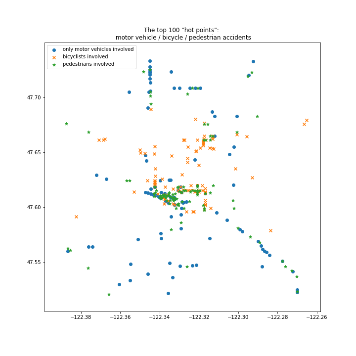
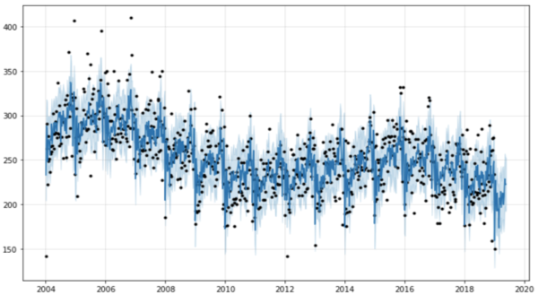

# Traffic Accidents in Seattle

##### *(Extending a project by Gulom Saidov)*

The city of Seattle publishes data about collisions in its area back to 2004, up to the recent month. I was interested in how these accidents are distributed in space and time – if a lot of accidents are clustered in a few places, where these places are, and if there are patterns in the timeline. The location information can be useful for city planners, or for insurance companies, who may charge more if your commute goes through high accident areas. – Using the time patterns, I intended to predict high/medium/low accident weeks in the future (to support resource allocation planning by police and paramedics). Finally, a prediction of the accident cost distribution over the near future can help insurance companies with their financial planning.

## EDA and clustering

The dataset contains geocoordinates, date and time, accident description (with 20 different values), counts of injuries, involved pedestrians and bicyclists, and weather/light conditions. It turns out the spots with the highest incidence can be identified by simple aggregation (by geocoordinates.) DBSCAN delivers bigger, continuous high-density areas. As expected, the inner city is one big high accident density area. – Interestingly, the hot spots for accidents including bicyclists are different than the hot spots for accidents that only include Motor vehicles. The same holds for pedestrian-related accidents, which form a third, separate, set.

## Time patterns and hypothesis

There is a strong daily pattern, with clear peaks at rush hours. There is also a seasonality over the year, with November being the peak month. A clearer distinction, however, is between weeks. For 13 week-pairs in the year, we can establish the hypothesis that their fluctuation is not random (with a significance level of 0.025). Based on this, we want to predict a general weekly pattern. (However, in some years the pattern (for a specific week) seems to be shifted by a week. This is possibly caused by the relative position of the weeks to holidays or other (Seattle-specific) events.)

## Predictive modeling

We apply a local Bayesian structural time series model to analyze the data. For this, we use the library ‘Prophet’ (provided by Facebook). The model it uses is composed of a nonlinear, saturating growth model (for the general trend), a seasonality-adapting part (Fourier-series) and added holiday/event effects. This way it is built for dealing with the seasonality we intend to capture. 

When we fit this model to our data 2005-2017, the yearly seasonality component clearly captures a pattern on weekly granularity, that resembles what we see in the average week-wise distribution (see picture). The predictions for short time-horizons work well. The prediction over the whole year 2018 is, however, only slightly better than the average of 2017 (our baseline), and the week-pattern for 2018 is not captured. – Interestingly, the model fitting does not find holiday effects, except for Christmas.

We tried also 2 other models: 1. A gradient boost classifier that relied on the week of the year and the holiday schedule, with the goal of classifying the weeks in low/high. -  2. LSTM (time series). – In both cases, our results are not better than random by now.

# Conclusion
We get a good prediction of the accident numbers per week for about the next 4 weeks. We get a still useful one for 10-20 weeks - meaning, it outperforms the baseline by a significant number. However, the peek weeks, and more general the seasonality of weeks, is not well captured by the model.

Reasons may be 
- the fundamental randomness of accidents: even with 200000 data points, there is still too much noise
- insufficient domain knowledge about the local events

## Future work

- Tuning the model: The model provided by Prophet seems not to capture holiday effects for this data set. We want to find out the reasons (are there really no holiday effects?). There are also probably other events (sports, concerts, festivals) that have even bigger effects but need to be included so the model can find these effects. Possibly here is a chance to get to a better prediction of the peak weeks. 
- Building a prediction model for expected cost. 
- Further investigating other models. Comparison to ARIMA. 

## **Source Data**

- Collisions: https://data-seattlecitygis.opendata.arcgis.com/datasets/5b5c745e0f1f48e7a53acec63a0022ab_0

For later use: 
- Roads: https://data-seattlecitygis.opendata.arcgis.com/datasets/seattle-streets
- Traffic flow: https://hub.arcgis.com/datasets/170b764c52f34c9497720c0463f3b58b_9
